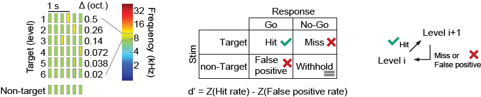
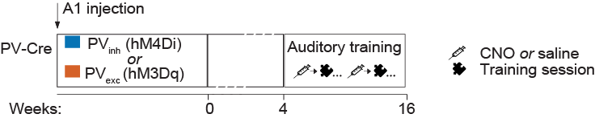
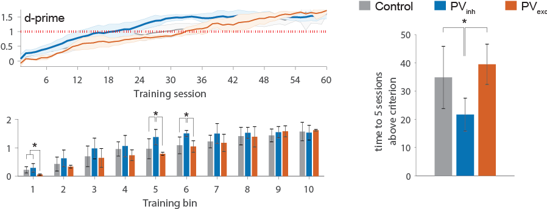
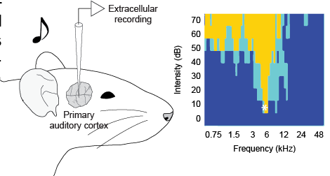
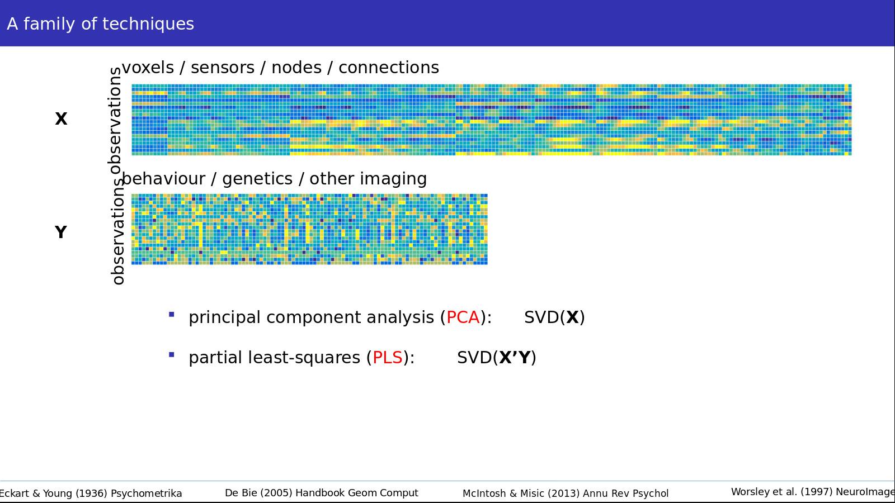

# About my work
<!--- I study sensory plasticity in rat auditory cortex using a combination of sound exposure :sound:, behaviour :chart_with_upwards_trend:, genetics :man_scientist:,  electrophysiology :zap:, and anatomy :microscope:. --->
I study sensory plasticity in rat auditory cortex using a combination of sound exposure, behaviour, genetics,  electrophysiology, and anatomy.

**TLDR**; check out my [to-do list](#My-to-do-list).

## Background

* M.D., _Univ Aut de Nuevo Leon, Monterrey, Mexico_ (2010) 
* Research intern  (2010-2011)  
   50% clinical, _National Institute of Neurology and Neurosurgery_  
   50% basic, _CINVESTAV - Neuropharmacology Unit_
   
* Research associate, _Univ Aut de Nuevo Leon, Monterrey, Mexico_ (2011-2012)     
* PhD student, _Mcgill University_ (current)

 

## What kind of data do I use?

* Experimental subjects

**Description**: n = 24 subjects, 45+ training sesions each, 10+ e-phys parameters each (see Behaviour and Electrophysiology, below)
 
 

* Behavior

**Description**: I use an auditory oddball discrimination task, in which subjects are presented with two kind of stimuli. The first one is the _non-target_ stimulus, which consists in a train of six identical tones \(which are referred to as standard tones; e.g., S-S-S-S-S-S\). The second type of stimulus is the _target_, in which one of the last four tones in the sequence \(chosen at random\) is replaced by a different "oddball" tone (e.g., S-S-S-O-S-S).

Importantly, the task is adaptive. If the subject adequately identifies the target tone (hit), difficulty is increased; i.e., the level goes up and the odball becomes closer to the standard tones. If the subject makes a mistake (miss, false positive), the level goes down. If the subject correctly ignores a non-target (withhold), there is no change in level.

<!--- Genetics, groups --->
<!---  --->

For each training session, we compute performance metrics such as hit rate, false positive rate, d-prime, or maximum level reached.
  

* Electrophysiology

**Description**: We use a microelectrode array to record simultaneously from 64 positions in auditory cortex. Once the electrodes are in place, we present a set of 60+ frequencies at different intensities \(from 0 to 70 dB\), which allows us to reconstruct a receptive fields (RF) for each recording position. Each RF gives us information about the selectivity of each recording position, as measured by bandwidth (frequency selectivity at each sound intensity) and intensity threshold (in dB). We can also compute other parameters including onset latencies, RF overlap between neighboring sites, and synchronization during spontaneous activity,
 

## What problems do I want to solve?

There are more measurements than experimental subjects, and measurements belong to distinct datasets (behavior and electrophysiology). 
  

# Objectives
## Main goals
1. Use multivariate analysis to understand the relationship between my two datasets.  
 

<!--

-->
slide from Bratislav Misic's [presentation](https://figshare.com/articles/Misic_BrainHack_2019_pptx/9387188) @ Brainhack school 2019
 

2. Cross-validate (using a "leave-one-out" approach?)
 
 
## My to-do list
* [X] Make sure my data is compatible with partial-least-squares analysis (PLS)

* [X] Import my matlab file with behav data

    * [X] Import as python object: use `from scipy.io import loadmat`
    * [X] Save code, that's my first `.py` file!

* [ ] Import e-phys data
    * [ ] Finalize analysis of e-phys data
    * [ ] Save data as matlab `struct` to be able to import it the same way I'm importing behav data
    * [ ] Import as python object

* [ ] Multivariate analysis
    * [ ] Run PLS
    * [ ] Cross-validate
    * [ ] Visualize, report, interpret...
 

# Some resources

I'll be keeping a list of useful commands and "lifehacks" I learn [here in my GH repo](https://github.com/mtl-brainhack-school-2019/Mike_repo/blob/master/Code_snippets.md).

Also, a random [list of errors](https://github.com/mtl-brainhack-school-2019/Mike_repo/blob/master/error-messages.md) I'm learning from in the process :man_shrugging:

  

# Acknowledgements

